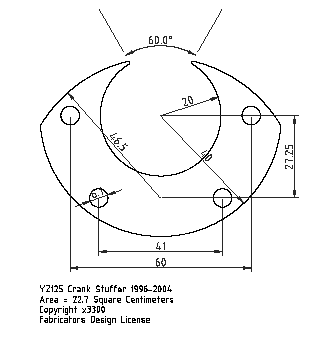

# moto-cad

CAD design files for motorcycle parts and tools.  Most files are in the [AutoCAD DXF](https://en.wikipedia.org/wiki/AutoCAD_DXF) format.

## yz125-crank-stuffer

## Licence & Usage

All files in the
[moto-cad project](https://github.com/moto-design/moto-cad),
unless otherwise noted, are covered by the 
[Fabricators Design License](https://github.com/moto-design/moto-cad/blob/master/fabricators-design-license.txt).
The text of the license describes what usage is allowed, and what obligations users have if they choose to use any files.
